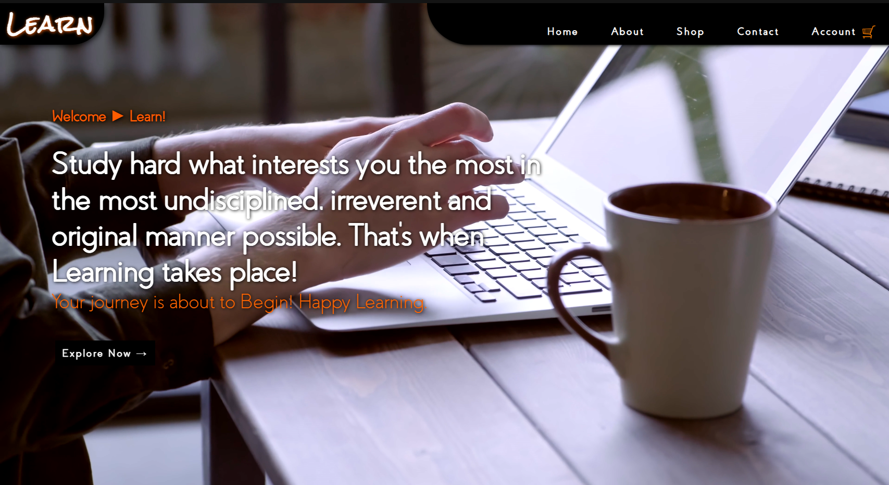
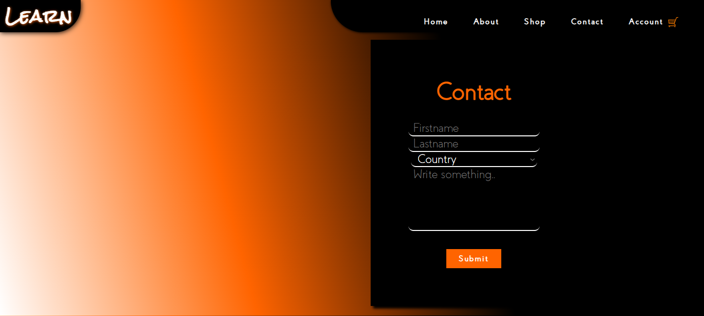
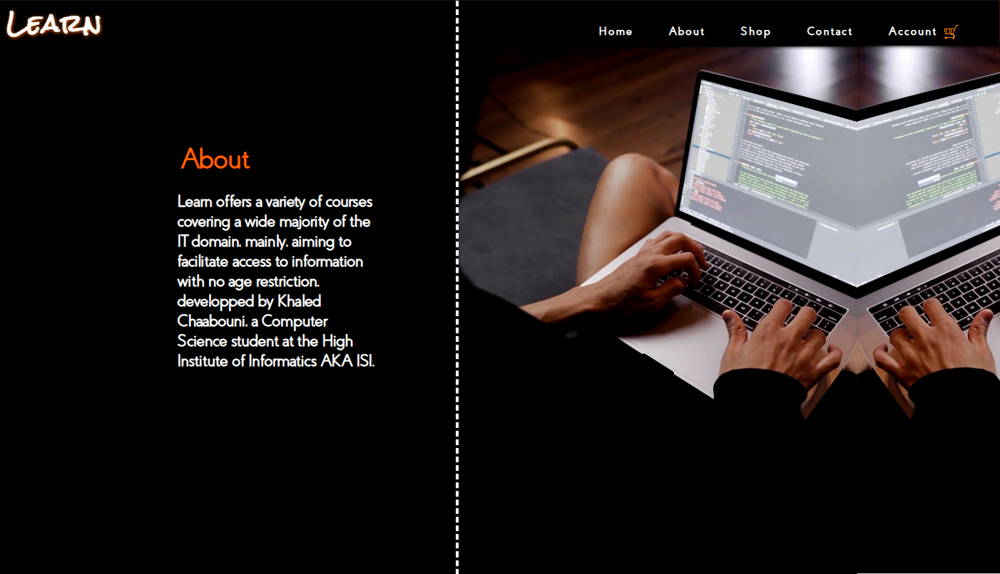
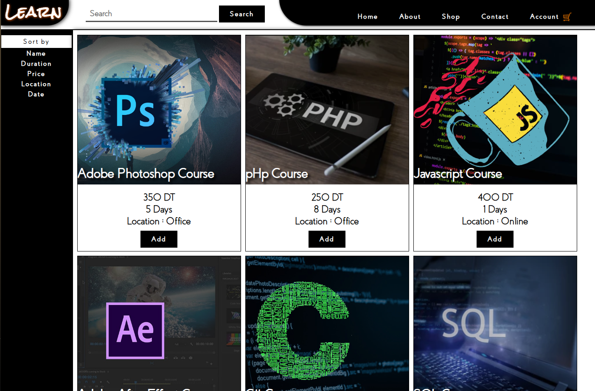
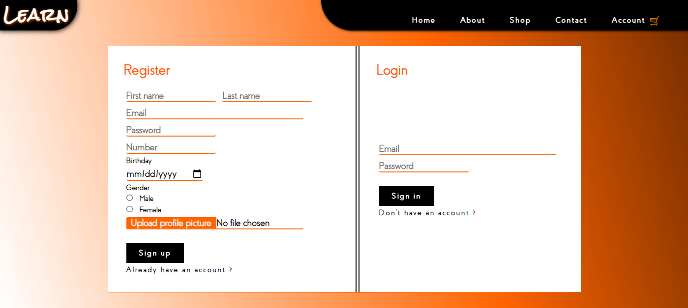

# Learn

Learn is a mid-studies project that takes shape as an educational platform, offering clients courses on different fields in the IT realm. It serves as my first PHP-based web application.

## Features

- **Home Tab**
  - 
  - The home tab provides an overview of the platform and showcases featured courses.

- **Contact Tab**
  - 
  - The contact tab allows users to get in touch with the platform's administrators for any queries or support.

- **About Tab**
  - 
  - The about tab provides information about the educational platform and its mission.

- **Shop Tab**
  - 
  - The shop tab allows users to browse and purchase courses from a wide range of IT disciplines.

- **Register/Login Tab**
  - 
  - The register/login tab provides a secure way for users to authenticate and access personalized features.

## Database Setup

To set up the necessary tables for Learn, follow these steps:

1. Open PHPMyAdmin in your local development environment (e.g., WampServer or XAMPP) and log in to your MySQL database.

2. Create a new database for Learn, if one does not already exist.

3. Select the newly created database from the left-hand side navigation pane.

4. Click on the "Import" tab in the top menu.

5. Choose the "accounts.sql" file from your local machine.

6. Click the "Go" button to import the tables.

7. Once the import is complete, the tables required for Learn will be set up in your database.

## Getting Started

To get started with Learn, follow these steps:

1. Clone the repository:

   git clone https://github.com/your-username/learn.git

2. Set up a local development environment with PHP and a web server (e.g., WampServer or XAMPP).

3. Configure the necessary database connection settings in the appropriate PHP files.

4. Launch your web server and access Learn in your browser.

5. Explore the different tabs to discover and engage with the available courses.

Feel free to customize and enhance Learn according to your requirements!

## License

This project is licensed under the [MIT License](LICENSE).
